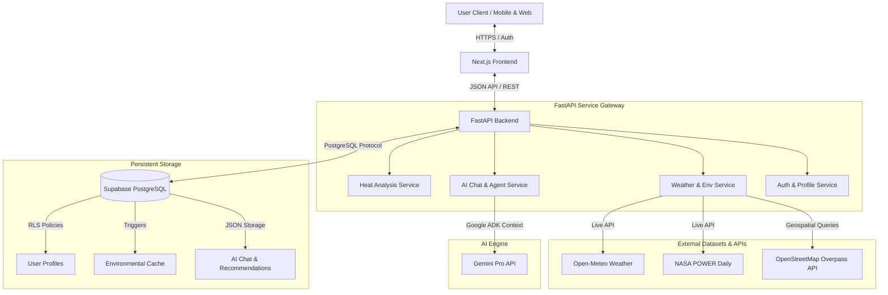

# 🌡️ Escape Heat — AI-Powered Urban Heat Decision Intelligence Platform

[](https://opensource.org/licenses/MIT)
[](https://nextjs.org/)
[](https://fastapi.tiangolo.com/)
[](https://supabase.com/)
[](https://ai.google.dev/)

**Escape Heat** is an advanced, AI-powered Decision Intelligence Platform designed to help citizens, outdoor workers, vulnerable individuals, and city planners understand urban heat conditions and make safer, data-driven daily decisions. 

Unlike traditional weather applications that merely display temperature forecasts, Escape Heat acts as a localized **deterministic heat intelligence engine** that calculates personal heat-related risk and generates personalized, actionable recommendations in real-time.

---

## 📖 Table of Contents
1. [🌟 Key Highlights & Hackathon Pitch](#-key-highlights--hackathon-pitch)
2. [🧩 Core Architecture & Data Pipeline](#-core-architecture--data-pipeline)
3. [🚀 Main Features](#-main-features)
4. [📂 Repository Directory Structure](#-repository-directory-structure)
5. [🛠️ Tech Stack & Integrations](#️-tech-stack--integrations)
6. [🗄️ Database Design & Schemas](#️-database-design--schemas)
7. [📊 Dataset Status & Management](#-dataset-status--management)
8. [💻 Developer Installation & Local Setup](#-developer-installation--local-setup)
9. [🗺️ Production Readiness & Deployment Map](#️-production-readiness--deployment-map)

---

## 🌟 Key Highlights & Hackathon Pitch

Urban heat is a silent killer. As climate change intensifies, **Urban Heat Islands (UHI)** trap temperatures in concrete jungles, leaving vulnerable groups at risk.
Traditional weather apps fail because:
* They only show raw metrics (e.g., "38°C, 72% humidity") without translating them to **human risk**.
* They don't account for personal health factors or specific activities (e.g., jogging vs. construction work).
* They lack localized action paths like finding nearby cooling centers or hydration stations.

### The Escape Heat Solution
Escape Heat solves this by introducing a **fully integrated decision intelligence loop**:
1. **Deterministic Risk Calculations**: Implements the Wet Bulb Globe Temperature (WBGT) and Heat Index (HI) models to calculate a precise risk score (0-100).
2. **Context-Aware Generative AI**: Feeds environmental data + personal preferences to Google Gemini via the **Agent Development Kit (ADK)** to explain insights in plain, conversational language.
3. **Actionable Mapping**: Utilizes open geospatial data (OSM) to locate and guide users to cooling shelters, water fountains, shade-covered parks, and medical facilities.

---

## 🧩 Core Architecture & Data Pipeline

The platform uses a modular, decoupled architecture consisting of a Next.js responsive client, a FastAPI service gateway, and a Supabase PostgreSQL backend database.



---

## 🚀 Main Features

### 1. Interactive Heat Dashboard
Provides a central command center for environmental safety.
* **Risk Gauge**: A 0–100 circular visualizer mapping safety thresholds (Low, Moderate, High, Extreme).
* **Six Critical Metrics**: Temperature, Feels-Like, Humidity, UV Index, Wind Speed, and Air Quality (AQI).
* **Data Visualization**: Interactive 24-hour temperature/humidity line charts and 7-day risk trend bars (powered by Chart.js).

### 2. Interactive Heat Map
A geospatial interface helping users "escape the heat" in real-time.
* **Urban Heat Islands**: Displays color-coded temperature overlays on OpenStreetMap.
* **Points of Interest (POIs)**: Maps local infrastructure such as public parks, hospitals, drinking water stations, and municipal cooling centers.
* **Filters**: Quick toggles to find resources within a specific walking radius.

### 3. Escape AI Assistant
A context-aware, empathetic chatbot powered by Gemini.
* **Contextual Prompts**: Answers natural language questions like *"Is it safe for my elderly mother to go out?"* or *"Can I walk my dog right now?"*.
* **Dynamic Integration**: Combines current weather data, local heat zone data, and user profile health profiles to provide personalized advice.
* **Suggested Queries**: Contextual, dynamic prompt recommendations.

### 4. Personal Recommendation Engine
Custom rules-backed health, hydration, and activity planner.
* **Activity Guidance**: Tailored recommendations for exercise, work, and rest.
* **Hydration Advice**: Custom hourly fluid intake formulas.
* **Safe-Time Scheduler**: Identifies optimal windows of the day for outdoor activities.

---

## 📂 Repository Directory Structure

The project is organized cleanly into modular microservices:

```
Escape-Heat/
├── backend/                       # Python FastAPI Backend
│   ├── app/
│   │   ├── api/                   # Router, Versioned HTTP Endpoints (v1)
│   │   ├── core/                  # Error handlers, JWT security, structured logging
│   │   ├── mock_data/             # JSON fixtures for local testing
│   │   ├── repositories/          # Data Access Objects (DAO)
│   │   ├── schemas/               # Pydantic Request/Response models
│   │   ├── services/              # Heat analysis, AI chat, maps, weather services
│   │   ├── config.py              # Settings loaded from environment variables
│   │   └── main.py                # FastAPI lifecycle & middleware entrypoint
│   ├── tests/                     # Unit & integration test suites
│   ├── requirements.txt           # Python backend dependencies
│   └── run.py                     # Backend startup script
│
├── escape-heat/                   # Next.js Frontend (React + TypeScript)
│   ├── app/                       # Page-level routes (Dashboard, Map, Assistant, etc.)
│   ├── components/                # Layouts (AppShell, Navbar) and UI widgets
│   ├── lib/                       # Utility functions, mock-data helpers, styling
│   ├── types/                     # Shared TypeScript interfaces
│   ├── public/                    # Static image assets, icons
│   └── package.json               # Frontend dependencies & npm scripts
│
├── database/                      # Supabase PostgreSQL database configurations
│   ├── migrations/                # Versioned SQL migrations (001 -> 012)
│   ├── seed/                      # Seed scripts with demo profiles, cities, & stats
│   ├── docs/                      # Comprehensive schema references & ER Diagrams
│   ├── verify.sql                 # Validation script with 25+ automated checks
│   └── reset.sql                  # Database purge script for development
│
└── data/                          # Geospatial and environmental data layers
    ├── environment/               # OSM parks, trees, and water bodies GeoJSON
    ├── weather/                   # Open-Meteo & NASA historical weather samples
    └── recommendations/           # Hydration rules and WHO activity protocols
```

---

## 🛠️ Tech Stack & Integrations

| Layer | Technology | Purpose |
| --- | --- | --- |
| **Frontend** | Next.js 16.2 (App Router), React 19.2 | High-performance, SEO-optimized user interface |
| **Styling** | Tailwind CSS v4, Lucide React, Framer Motion | Smooth, modern dashboard with dark/light themes |
| **Charts** | Chart.js, react-chartjs-2 | Interactive weather and risk data visualization |
| **Maps** | Leaflet, react-leaflet, OpenStreetMap | Interactive GIS map with heat overlays & POIs |
| **Backend** | FastAPI 0.115, Uvicorn | High-throughput, async Python API service gateway |
| **Validation** | Pydantic v2 | Robust request validation and API type-safety |
| **Database** | PostgreSQL (Supabase) | Multi-tenant persistent database |
| **Authentication** | Supabase Auth | Secure email/password and OAuth user management |
| **AI Engine** | Google Gemini API, Google ADK | Context-aware reasoning, natural language answers |
| **Weather API** | Open-Meteo & NASA POWER | Live historical and real-time meteorology |

---

## 🗄️ Database Design & Schemas

The database layer consists of a fully relational schema engineered for PostgreSQL on Supabase. Row-Level Security (RLS) is fully configured for privacy.

### Key Database Tables
* **`profiles`**: Extends the default Supabase `auth.users` with personal details (name, avatar, health profiles).
* **`user_preferences`**: Stores units (Celsius vs Fahrenheit), notifications, and theme settings.
* **`saved_locations`**: Stores bookmarked coordinates for fast retrieval (max 25 locations).
* **`environmental_cache`**: Caches weather & satellite readings by rounded coordinates to prevent API rate limits.
* **`recommendation_history`**: Saves recommendations generated for users, including risk scores at generation time.
* **`ai_chat_history`**: Stores chat histories divided by conversation sessions.
* **`reports`**: Stores downloadable PDF/JSON urban heat audit reports, including sharing tokens.

> Detailed specifications of all constraints, indices, triggers, and RPC procedures can be found in the [Database Schema Reference](file:///d:/Project/July%20participation/Gen%20AI%20cohort%20Hackathon/Escape%20Heat/database/docs/SCHEMA.md).

---

## 📊 Dataset Status & Management

The platform ingests multiple open-source datasets to feed the heat intelligence models:
* **Open-Meteo API**: Fetches real-time temperature, humidity, wind, and UV indexes.
* **NASA POWER API**: Gathers daily point solar radiation and long-term climatology data.
* **OpenStreetMap (Overpass API)**: Dynamic search queries fetch parks, hospitals, water bodies, and clinics.
* **National Disaster Management Authority (NDMA) & WHO Guidelines**: Coded rules for hydration, activity risk thresholds, and outdoor safety margins.

Refer to [DATA_STATUS.md](file:///d:/Project/July%20participation/Gen%20AI%20cohort%20Hackathon/Escape%20Heat/data/DATA_STATUS.md) for full information, licensing details, and instructions to download the **IMD Gridded Meteorological Data** and high-resolution **Land Surface Temperature (LST)** satellite imagery.

---

## 💻 Developer Installation & Local Setup

### 1. Database Setup (Supabase)
1. Set up a PostgreSQL project on [Supabase](https://supabase.com/).
2. Open the **SQL Editor** in the Supabase Dashboard.
3. Paste and run the contents of [000_full_migration.sql](file:///d:/Project/July%20participation/Gen%20AI%20cohort%20Hackathon/Escape%20Heat/database/migrations/000_full_migration.sql).
4. Run [011_helper_functions.sql](file:///d:/Project/July%20participation/Gen%20AI%20cohort%20Hackathon/Escape%20Heat/database/migrations/011_helper_functions.sql) and [012_analytics_views.sql](file:///d:/Project/July%20participation/Gen%20AI%20cohort%20Hackathon/Escape%20Heat/database/migrations/012_analytics_views.sql).
5. Load demo data by running [seed_data.sql](file:///d:/Project/July%20participation/Gen%20AI%20cohort%20Hackathon/Escape%20Heat/database/seed/seed_data.sql).
6. Verify database setup by running [verify.sql](file:///d:/Project/July%20participation/Gen%20AI%20cohort%20Hackathon/Escape%20Heat/database/verify.sql).

### 2. Backend API Setup
```bash
# Navigate to the backend directory
cd backend

# Create and activate a Python virtual environment
python -m venv venv
venv\Scripts\activate   # Windows
# source venv/bin/activate # macOS/Linux

# Install requirements
pip install -r requirements.txt

# Copy backend environment config
copy .env.example .env

# Run FastAPI dev server
python run.py
```
* Backend API endpoints: `http://localhost:8000`
* Swagger UI Docs: `http://localhost:8000/docs`

### 3. Frontend Next.js Setup
```bash
# Navigate to the frontend directory
cd escape-heat

# Install dependencies
npm install

# Run the dev server
npm run dev
```
* Frontend client: `http://localhost:3000`

---

## 🗺️ Production Readiness & Deployment Map

To see the complete transition path from the current MVP/Prototype state to a production-hardened launch, check out the comprehensive [PROJECT_MAP.md](file:///d:/Project/July%20participation/Gen%20AI%20cohort%20Hackathon/Escape%20Heat/PROJECT_MAP.md) file. This document details:
* Live API configuration (Open-Meteo, NASA).
* Real Supabase Authentication and Client integration.
* Google Gemini API with Google ADK setup.
* Hardening pipelines (Redis Caching, Gunicorn, HTTPS redirection).
* CI/CD automation & multi-tier staging-to-production setups.
