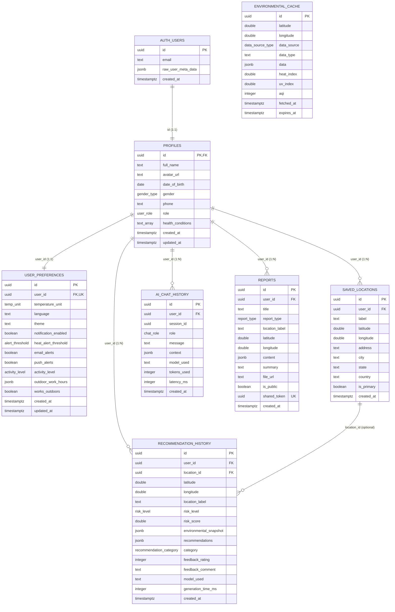
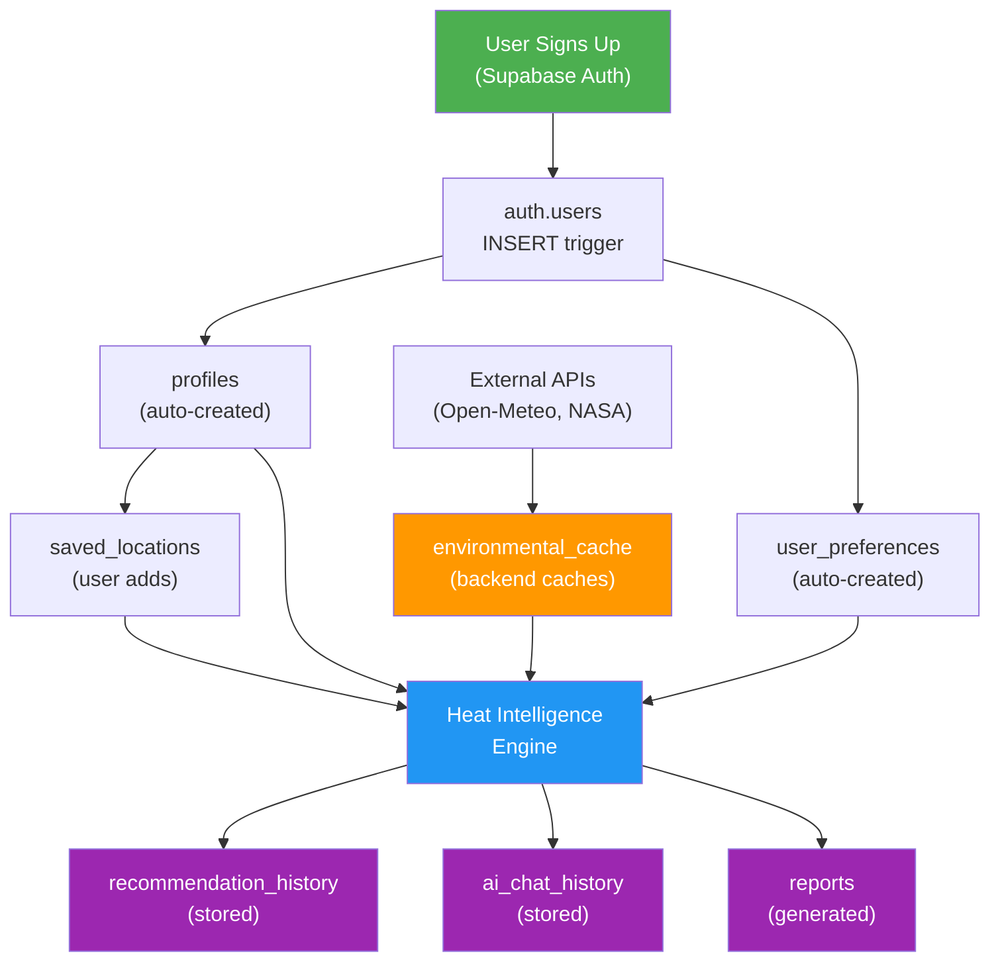

# Escape Heat — ER Diagram

## Entity Relationship Diagram

## Relationship Summary

| Relationship | Type | Cascade | Notes |
|---|---|---|---|
| `auth.users` → `profiles` | 1:1 | ON DELETE CASCADE | Auto-created via trigger |
| `profiles` → `user_preferences` | 1:1 | ON DELETE CASCADE | Auto-created via trigger |
| `profiles` → `saved_locations` | 1:N | ON DELETE CASCADE | Max 25 per user |
| `profiles` → `recommendation_history` | 1:N | ON DELETE CASCADE | Retained indefinitely |
| `profiles` → `ai_chat_history` | 1:N | ON DELETE CASCADE | Retained indefinitely |
| `profiles` → `reports` | 1:N | ON DELETE CASCADE | Supports public sharing |
| `saved_locations` → `recommendation_history` | 1:N (optional) | ON DELETE SET NULL | Location reference preserved as lat/lng snapshot |
| `environmental_cache` | Standalone | N/A | Ephemeral, auto-cleaned hourly |

## Data Flow

